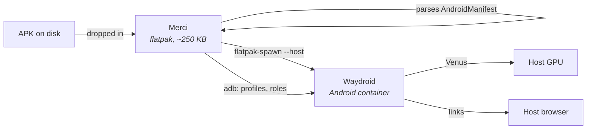

<div align="center">


# Merci

[Русский](README.md) · **English**

**Android apps on Linux — drop in an APK and launch it.**

[](https://github.com/melineceo/Merci/releases)
[](#-this-is-a-beta)
[](LICENSE)
[](#install)

</div>

---

## ⚠️ This is a beta

Merci works and does what it promises, but it has been tested on a single
machine and a single combination of parts. In practice that means:

- **Acceleration is polished for NVIDIA only.** Stock Waydroid renders through
  Mesa, and Mesa cannot drive the proprietary NVIDIA driver — the CPU would end
  up doing the drawing. Merci installs and configures `waydroid-nvidia` (Venus
  on top of the proprietary driver), and that path is verified on a live
  machine. On AMD and Intel the app starts and runs, but nobody measured frame
  rates there and there are no separate settings for them.
- **Tested on CachyOS (Arch) with Hyprland/Wayland.** Missing pieces are
  installed through `pacman` and the AUR, so the setup wizard will not work on
  non-Arch distributions — the app itself works fine with an already configured
  Waydroid.
- Bugs and rough edges are expected. If something is wrong, open an issue; the
  README below explains in detail how everything works inside.

---

An alternative to Sober: an APK library with a graphical shell where you can
drop in **any** Android APK, not just the official Roblox client.

Merci parses the APK itself (package, version, launcher activity, ABIs, icon),
installs it into Waydroid and launches it — no commands and no container
configuration required from you.

| What is in the APK | How it runs | Speed |
|---|---|---|
| code for the machine's CPU (`x86_64`, `x86`), or no native code at all | directly on the CPU | full |
| `arm64-v8a` / `armeabi-v7a` only | through a native bridge (`libhoudini`) inside the container | lower, ARM64 → x86_64 translation |

In both cases the host GPU does the rendering.



## Install

You need `flatpak`. The GNOME runtime comes from Flathub, the application
itself from the Merci repository:

```bash
flatpak remote-add --user --if-not-exists flathub \
  https://dl.flathub.org/repo/flathub.flatpakrepo
flatpak remote-add --user --if-not-exists merci \
  https://melineceo.github.io/Merci/merci.flatpakrepo
flatpak install --user merci xyz.hackerstone.Merci
```

Run it with `flatpak run xyz.hackerstone.Merci` or the “Merci” entry in your
application menu.

### Update

```bash
flatpak update --user xyz.hackerstone.Merci
```

New versions appear in the same repository, so a bare `flatpak update` picks
Merci up along with everything else.

### Without the repository

Every release ships a `Merci.flatpak` file for when the repository is
unreachable. Such an installation cannot update itself:

```bash
flatpak install --user ./Merci.flatpak
```

On first run Merci offers to set Waydroid up: it checks the kernel module, the
package, the Android image, the session and ARM64 translation, then installs
what is missing while showing a live log. Your password will be needed — the
container and the kernel module live on the host.

## Features

- **Drop an APK into the window** — Merci reads `AndroidManifest.xml` (its own
  binary AXML parser, no external dependencies), pulls out the icon and decides
  whether this APK needs a native bridge.
- **Automatic Waydroid setup** — the wizard checks the kernel module, package,
  Android image, session and ARM64 translation, installs what is missing and
  shows a live log.
- **The interface never waits on the host.** Every call to waydroid goes to a
  separate thread, state is cached for a few seconds and icons are kept as ready
  textures. Earlier every click on an app spawned several processes through the
  portal right on the main thread — and the window froze.
- **Render resolution** is set in the card. It is a container property
  (`persist.waydroid.width/height`), so Merci restarts the session as well —
  otherwise the value is not picked up. The picture is stretched to the monitor.
- **Crash reports** are read without root: Android writes them to
  `data/tombstones`, not only to `logcat`. Merci checks them 12 seconds after a
  launch and tells you when the app crashed — before that it just looked like
  “it did not start”, and you wanted to press the button again.
- **Several builds of one package** live side by side in the library: the entry
  key is the package plus a hash of the file. Android will not let you install
  them into the container at the same time (see the profiles section below), but
  Merci explains that and offers to replace the installation with one click.
- **Android profiles (MultiUser)** — separate data for one app: a second
  account without logging out of the first.
- **A tray icon** with container controls, and the window hides itself once the
  game starts.
- **Two interface languages** — Russian and English. The choice is saved in the
  settings and the window is redrawn right away; by default the system language
  is used.
- **No access to `$HOME`**: an APK gets in only through the file portal or by
  drag and drop, one file at a time.

## Building from source

```bash
./scripts/build.sh
flatpak run xyz.hackerstone.Merci
```

The script pulls `org.gnome.Platform//50` and `org.gnome.Sdk//50` from Flathub,
builds the flatpak into the local `repo/` and installs it into the user
installation. The flatpak itself is tiny — about 250 KB: all of Android lives
in the container on the host.

**Build for x86_64 only.** An aarch64 build existed in order to run ARM code
through qemu-user, and that path turned out to be a dead end. If it is still
installed, remove it — otherwise `flatpak run` without `--arch` sometimes starts
exactly that one, and then everything is slow, the interface included:

```bash
flatpak uninstall --user --arch=aarch64 xyz.hackerstone.Merci
```

Merci notices on its own that it is running under emulation and says so at
startup.

## Setting Waydroid up

The wizard (“Set up” in the banner or the menu entry) builds a plan out of
whatever is missing and runs the steps one by one, showing the output in a log:

| Step | How it is done |
|---|---|
| `binder` kernel module | skipped when the kernel already has binder (CachyOS does: `CONFIG_ANDROID_BINDERFS=y`) |
| `waydroid` package | `sudo pacman -S --needed waydroid` — it is in the `extra` repository |
| Android image | `sudo waydroid init`, ~1 GB from sourceforge |
| Session | `waydroid session start` — a background step: the command never exits, it *is* the session process, so readiness is checked with `waydroid status` |
| Internet access | `ufw allow in on waydroid0` — by default `ufw` cuts DHCP and forwarding for the container |
| Translator archive | downloaded by Merci itself: resumable with `-C -`, with retries and an md5 check |
| ARM64 → x86_64 translation | `waydroid_script` from GitHub, then `install libhoudini` |

What you see while it runs:

- a large percentage and a progress bar — and they are real: `waydroid init`
  prints `[Downloading] 519.31 MB/1235.02 MB   8.3 MB/s`, and Merci parses that
  line into percent, speed and remaining time;
- the name of the current phase in plain words (“Downloading the system image”,
  “Unpacking the image”, “Configuring the container”);
- the step number, the elapsed time and a cancel button;
- a log with the full command output — collapsed while everything goes well;
- when a step is silent for more than 20 seconds, a line about it appears in the
  log: silence usually means a password prompt, not a hang.

Merci never sees or asks for your root password. Privileged steps go through
`sudo -A`: the password is asked by a **system dialog** (`kdialog`, or `zenity`
when it is missing) and handed straight to sudo. The helper for that is a
three-line `askpass.sh` in Merci's data, and its last line is `exec`, so once the
dialog starts there is not a single command of ours left in the chain that
carries the password. Input is hidden and the window takes focus itself.

A terminal running `sudo` stays as a fallback — for systems with neither
`kdialog` nor `zenity`. It has two known traps, and both are handled: the
terminal window may fail to get keyboard focus (and then the password goes into
another window), and the command must not be wrapped in `timeout` without
`--foreground` — otherwise it lands in a background process group and `sudo`
gets `SIGTTIN` when it tries to read the password, stopping right after printing
the prompt.

`pkexec` is not used: in sessions like Hyprland polkit often believes an agent
is already registered while in fact there is nobody to ask, and then `pkexec`
hangs silently and forever, with no error and no timeout.

### When the image server is unreachable

`waydroid init` starts by contacting `ota.waydro.id` — the pointer to the
images, served through GitHub Pages. The request goes through `urllib` **without
a timeout**, so when it is blocked the command hangs forever and silently: no
error, no output, no exit. From the outside it looks like a frozen installer.

Merci checks the connection in a separate “Connection to the image server” step
and fails it within 15 seconds with a clear explanation. From there:

- turn a VPN on and press “Check again”;
- write your own mirror into `ota.conf` in Merci's data (first line system,
  second vendor). The check step is then skipped and the addresses go into
  `waydroid init -c … -v …`:

```bash
printf '%s\n%s\n' https://mirror/system https://mirror/vendor \
  > ~/.var/app/xyz.hackerstone.Merci/data/merci/ota.conf
```

Merci does not try to download the images straight from SourceForge: the files
are there, but mirror speeds turned out to be around 70 KB/s — a one-gigabyte
image would take hours.

Every privileged step is wrapped in `timeout --foreground 3600`, so nothing can
hang forever. The `--foreground` flag is mandatory here: without it `timeout`
moves the command into its own process group, the terminal treats it as a
background job, and reading the password earns a `SIGTTIN` — `sudo` stops right
after printing the prompt and the input is never read.

One more subtlety, the reason progress used to never appear at all: `waydroid`
is written in Python, and Python buffers pipe output in 8 KB blocks. Progress
lines stayed in the buffer and reached neither the log nor the terminal. That is
why commands are started with `PYTHONUNBUFFERED=1`.

## Frame rate in Waydroid

The container renders **on the CPU**, and its properties show it:

```
ro.hardware.gralloc=default
ro.hardware.egl=swiftshader
```

Waydroid only enables the hardware path with `gralloc=gbm`, and that requires
Mesa to know the host GPU. With the proprietary NVIDIA driver it does not:
Mesa cannot see such a card (`nouveau` is not loaded either), so Waydroid picks
software rendering itself. No setting fixes that — either move to `nouveau`/NVK
or live with it.

That leaves exactly one lever — **the number of pixels** — and Merci pulls it
for you. The setup wizard adds two steps when they are needed:

| Step | What it does |
|---|---|
| Install gamescope | `pacman -S --needed gamescope` when it is missing; the step waits for somebody else's pacman and clears an orphaned `db.lck` |
| Fit to the screen | sets the container to 1280×720 and starts the session inside gamescope, output filling the whole monitor |

The container then draws half as many pixels while the image still fills the
screen. It gets slightly blurry — that is the price of scaling.

Before that Merci checks that gamescope **actually works** on this machine: it
runs it empty and looks whether it is still alive five seconds later. With the
proprietary NVIDIA driver it dies before the window
(`vkGetPhysicalDeviceFormatProperties2 returned zero modifiers`,
`NVVM compilation failed`), and the exit code is not enough here — it manages to
exit with zero. When the probe fails there is no stretching, and the container
window simply gets the size of the monitor: more pixels, but no black bars.

Why this way: **Waydroid does not scale its own window**. Its surface always
equals the container resolution, and `wm size` does not stretch the picture — it
draws a smaller screen in the corner of a large surface, which is where the grey
bars come from. Only an external compositor can stretch it, which is why the
session is started inside gamescope:

```sh
gamescope -W 1920 -H 1080 -w 1280 -h 720 -f -- waydroid session start
```

The same thing can be set by hand in the app card: the resolution field, a
button next to it that fills in the monitor size, and an empty field that puts
everything back. When gamescope is not installed, Merci offers to install it.
With hardware rendering there is nothing to shrink, and the fitting step never
makes it into the plan.

## Tray icon and hiding

Merci lives in the system tray: a left click opens the window, a right click
opens a menu with the things you need most often.

```
Open Merci
Open the Android window       the container's full desktop
Open the running game         raises the last thing you launched
Start Waydroid
Stop Waydroid
Quit Merci
```

The close button hides the window into the tray instead of quitting the program —
quitting is in the same menu. Without a tray in the system the close button
behaves as usual.

**“Hide Merci when an app launches”** (Settings → Window, on by default): a
couple of seconds after the game starts, the Merci window goes to the tray — the
library was needed right up to the click, and on top of the game it is in the
way.

There is no such thing as a tray on Wayland: the panel keeps an
`org.kde.StatusNotifierWatcher` service on the bus, the application registers its
own object in it and then answers questions about the icon and the menu itself.
GTK4 has no API left for this (GtkStatusIcon is gone, libappindicator lives in
GTK3), so both sides of the conversation — `StatusNotifierItem` and
`com.canonical.dbusmenu` — are written directly through Gio in
[src/merci/tray.py](src/merci/tray.py). Registration goes by the unique
connection name, so one permission is enough from inside the sandbox —
`--talk-name=org.kde.StatusNotifierWatcher`, without owning anybody else's name.

## Android profiles (MultiUser)

An Android profile gives one app **separate data**: its own login, its own
cache, its own settings. That is how you run a second account without logging
out of the first. Turn it on in Settings → Use MultiUser, and a profile selector
appears in the card: “main”, the profiles you already have and “New profile…”.
Merci installs the app into the chosen profile and switches the container to it
before launching.

Android shows one user on screen at a time, so profiles work in turns rather
than simultaneously; switching takes a few seconds.

A one-time preparation (Merci offers it itself; your password is needed):

- installs `android-tools` — that is `adb`;
- writes `fw.max_users=4` into `waydroid_base.prop`: without it Android in this
  image keeps a single user and refuses to create a second one;
- writes `ro.adb.secure=0` there too. Merci talks to `pm` and `am` through the
  container's `adbd`, and with key checking the first connection runs into a
  confirmation window inside Android. The port only listens on the container
  bridge (`192.168.240.1/24`), and it was open on the machine before anyway.

Through `adb` rather than the usual way, because the Waydroid service — the one
behind `waydroid app install` and `launch` — only knows user zero: it can
neither install into a profile nor launch inside one.

Two subtleties, without which the profiles looked broken:

- **The window.** Waydroid is single-window by default and shows whichever app
  is named in the `waydroid.active_apps` property. `waydroid app launch` sets
  it, `am start` does not, so an app in a profile honestly ran (`ps` showed a
  `u10_…` process) while there was no window at all. Merci now sets the property
  itself, the way waydroid does, along with the `policy_control` display mode.
- **Returning to the main profile.** The container's profile is shared state.
  Launching an app from the main profile returns the container to user zero even
  if MultiUser was turned off afterwards: otherwise the app starts in profile
  zero while a different one stays on screen — and again there is no window.

### What profiles do not give you

**Two different builds of one package.** For Android a package name is one
installation for the whole device: profiles share the app code and differ only
in data. The regular Roblox client and a modified one carry the same name
`com.roblox.client` but are signed with different keys, and the container says
so plainly:

```
INSTALL_FAILED_UPDATE_INCOMPATIBLE: Existing package com.roblox.client
signatures do not match newer version; ignoring!
```

Neither `--user` nor allowing a downgrade helps here — verified on a live
container. So Merci does not pretend it can bend that rule: when you launch the
second build it explains what is happening and offers to **replace the
installation** — remove the previous one and install this. The previous build's
data inside Android is erased in the process: Android requires that when the
signature changes.

Merci compares builds by the file itself, not by the package name. The name is
not enough: the regular and the modified client share it, and on a “the package
is already installed” check Merci once silently opened somebody else's build and
reported success. Now the beginning of the sha256 is compared — ours is in the
entry key, and the container's comes from `sha256sum` over the installed
`base.apk`. The card shows this in the “Build in the container” row: “this one —
ready to launch” or “a different one (version …) — Merci will offer to replace
it on launch”.

If you really want two builds at once, the only honest path is for them to have
**different package names**. That is decided not by Merci but by whoever built
the APK: some modified clients deliberately ship under their own package name,
and then they live next to the regular one just fine.

## Removing apps from the container

The card has two different buttons:

- **“Remove from the container”** — uninstalls from Waydroid together with the
  data inside Android; the APK stays in the library;
- **“Delete from the library”** — erases the APK and its data here, then removes
  the installation from the container as well. If another library entry uses the
  same package, the installation is left alone: otherwise deleting one build
  would take its neighbour with it.

Removal goes three ways, from quiet to visible. Through `adb` when it is
available (it arrives with MultiUser) — the most reliable one. Otherwise through
the stock Waydroid service — but that one can refuse silently: it prints
`Failed with code: -3` and exits with zero, which is why Merci checks the output
rather than the exit code. If the service refused, the `ACTION_DELETE` intent
takes over: Android shows its usual “uninstall this app?” question in the
container window, and Merci offers to open that window.

## Root inside the container

Menu → “Install root (Magisk)”. Magisk Delta is installed through the same
`waydroid_script`: this is your own Android, so access to system partitions,
debugging and modules is a normal capability here.

One subtlety in somebody else's code: for Magisk `waydroid_script` **deletes the
already downloaded file and downloads it again**, without checking the sum. On
an unstable link that is a guaranteed failure, so Merci downloads the APK itself
(resumable, with retries) and makes the download conditional in its own copy of
the script — two `sed` calls over `stuff/magisk.py`, with the reasoning written
right in the step.

Root does not pass device checks in games and cannot — quite the opposite, to
such checks a container with Magisk looks even more suspicious. Merci does not
install attestation-spoofing modules.

It is removed the same way: “Remove root (Magisk)” in the menu runs
`waydroid_script remove magisk` and restarts the container. Installing root
without a way to remove it is a bad deal.

## Hardware acceleration on NVIDIA

Stock Waydroid renders through Mesa, and Mesa cannot drive the proprietary
NVIDIA driver — hence `ro.hardware.egl=swiftshader` and CPU rendering. The
[waydroid-nvidia](https://github.com/Shiro836/waydroid-nvidia) project works
around it: the guest gets Mesa Venus, and Vulkan calls are proxied through a
unix socket into the host's real driver.

Menu → “NVIDIA hardware acceleration”. Merci first checks whether the machine
qualifies and refuses when it does not:

| Requirement | Why |
|---|---|
| open kernel modules (`nvidia-open`) | the proprietary ones have no DMA-BUF, and here every displayed buffer is exactly that |
| driver 595.71+ | the required interfaces are missing in earlier versions |
| Turing or newer | a consequence of the open modules |

The step installs `waydroid-nvidia-bin` from the AUR (the package **replaces**
`waydroid` — the same Waydroid with patches; the image and your data stay), runs
`waydroid-nvidia-setup` with your monitor's refresh rate, enables the
`waydroid-container` and `wd-venus` services and restarts the session. `yay`
runs as your user, and its inner `sudo` gets `-A` so that the same system dialog
asks for the password.

Checking the result:

```bash
sudo waydroid shell dumpsys SurfaceFlinger | grep GLES
# ANGLE (NVIDIA, Vulkan ... Venus (NVIDIA GeForce ...)) should appear
```

If the line looks like that, the GPU is drawing, and shrinking the resolution
for speed is no longer needed.

## Flickering picture

The symptom is distinctive: the frame freezes and the picture refreshes **only
on events** — any key press (even Alt, which opens nothing), the pointer
entering the window, the on-screen keyboard appearing.

The cause is the `persist.waydroid.use_subsurface` mode, which waydroid-nvidia
enables by default. Android layers are drawn into `wl_subsurface`, and a
synchronous subsurface is only shown when the **parent** surface commits. The
parent stays quiet — the frame hangs; any event makes it commit, and the picture
“heals”.

Merci detects that state and adds a “Fix flickering picture” step to the plan
(it is also a separate menu entry). The step turns the mode off **in both files**
and restarts the container:

| File | Why it must be edited |
|---|---|
| `waydroid.cfg` | applied when the session starts |
| `waydroid_base.prop` | read by `init` when the container boots — otherwise a restart brings the old value back |

By the way, the difference between those two files is worth remembering in
general: Android only allows `ro.*` properties to be set before `init` starts,
so from `waydroid.cfg` they are silently ignored and only work from
`waydroid_base.prop`. It is an easy thing to get caught by.

## Links in the host browser

Waydroid has no way to pass links from the container to the host — only the
other direction works (`waydroid app intent`); this is open issue
[waydroid#210](https://github.com/waydroid/waydroid/issues/210). So a link from
an app opens in Android's own browser.

Merci closes the gap with its own forwarder. The “Links in the host browser”
menu entry builds and installs it:

- **An Android app** ([data/urlforward](data/urlforward)) — an activity with no
  interface and an `intent-filter` on `VIEW` for `http`/`https`. Having received
  a link it sends it to the container's gateway and closes immediately.
- **A service on the host** — `merci-url-listener.py` under the user's systemd.
  It listens **only** on the bridge address `192.168.240.1:7749`: reachable from
  the container, not from outside the machine. It accepts nothing but
  `http`/`https` and passes the address to `xdg-open` as an argument list,
  without a shell.

The build runs without Gradle, in four calls: `javac` → `d8` → `aapt2 link` →
`apksigner`. The tools needed are a JDK (repository) and
`android-sdk-build-tools` (AUR, with dependencies only from the repositories).
`android.jar` is downloaded **as a single file** from `dl.google.com`: the
`android-platform` package would drag in `android-sdk` and
`android-sdk-platform-tools` — half the SDK for one library that is only needed
at compile time.

Checking the installation with `waydroid app list` is useless: that lists only
apps with an icon in the menu, and the forwarder has none. Merci looks at the
data directory Android creates when a package is installed.

### The default browser inside Android

Installing the forwarder is not enough — Android would ask what to open every
link with. So the step also makes it the **default browser** the way Android
intends, through a role:

```
cmd role add-role-holder --user 0 android.app.role.BROWSER xyz.hackerstone.merci.urlopen
```

The forwarder qualifies for that role: it catches `http` and `https` without
naming a host, so from Android's point of view it behaves like a browser. `adb`
is required — it arrives with MultiUser; without it the step honestly says there
is nothing to assign with.

**Each profile has its own role.** A game launched in profile #10 opened links
in Android's internal browser, because the role belonged to it there and the
forwarder was not enabled in that profile. So before launching in a profile
Merci enables the forwarder there and grants the role:

```
cmd package install-existing --user 10 xyz.hackerstone.merci.urlopen
cmd role add-role-holder --user 10 android.app.role.BROWSER xyz.hackerstone.merci.urlopen
```

`install-existing` enables a package already present in the container for that
profile — there is nothing to download or install again. A new profile gets the
same treatment when it is created.

Two more fixes along the way: the APK signing key now lives next to the sources
instead of being generated on every build — otherwise Android refused to update
an already installed forwarder (“signatures do not match”). And a failed send is
no longer swallowed silently but written to the Android log: without it “the
link did not open” looked like an empty space with nothing to search in.

## Restarting the container

The arrow button next to “Launch” (the same row is in the card, and there is an
entry in the tray menu). It is needed more often than you would think.

**Right after the machine boots** the container comes up “halfway”: the session
is running while there is no network inside, and `waydroid status` prints this
instead of an address:

```
Session:    RUNNING
Container:  RUNNING
IP address: UNKNOWN
```

Merci talks to the container over adb, and that word used to go into the command
verbatim — hence the error `error: device 'UNKNOWN:5555' not found`. Now only
something that looks like an address is accepted as one, and when there is no
address Merci waits for it and, having waited in vain, restarts the session
itself. That is usually enough: the address appears within some twenty seconds.

**When it is not enough.** Android inside survives a session restart — the
container keeps running and its uptime does not reset. If it is the container
that hung (ARP to it does not resolve, `waydroid prop` answers “Failed to get
service waydroidplatform”), you can restart the session as many times as you
like to no effect. So Merci checks not only the address but also that the
container answers, and in that case offers to restart it entirely — that is
`systemctl restart waydroid-container` and a password.

## Stopping the container

The “Stop Waydroid” menu entry stops the container completely. One command is
not enough for that: `waydroid session stop` regularly runs into a D-Bus timeout
and leaves the session manager process alive — after which the state diverges,
`waydroid status` shows RUNNING while `waydroid prop` answers that the session
is stopped. So after the command Merci finishes off the leftovers and checks the
result with `waydroid status` rather than the exit code.

## Roblox error 317

`This game has enabled additional hardware security requirements` is a
server-side check enabled by **the author of that particular game**. It requires
hardware attestation of the device (Play Integrity), and Waydroid is LineageOS
with test keys and without Google services, so it will never pass. That cannot
and should not be worked around: it is the game's protection, not a breakage.
Games without that setting work.

## Flatpak permissions

| Permission | What for |
|---|---|
| `--socket=wayland`, `--socket=fallback-x11`, `--share=ipc` | the window |
| `--device=dri` | the GPU for the interface |
| `--socket=pulseaudio`, `--share=network` | sound and network |
| `--talk-name=org.freedesktop.Flatpak` | `flatpak-spawn --host` for talking to Waydroid |

The last one is a deliberate concession worth understanding: it means running
commands on the host, that is, leaving the sandbox. Waydroid is unreachable
otherwise — it is a host service with a kernel module and a systemd unit. Only
`waydroid`, `pacman` and `pkexec` are called from there, for the setup steps.

## Why there is only one way to launch

Merci used to be able to run APKs inside itself as well, through
[ATL](https://gitlab.com/android_translation_layer/android_translation_layer):
ART executes the dex, the Android API is reimplemented on top of the host's
glibc, the window is native — the same principle Sober uses. That path started
fast and needed no container. It was removed, and here is why.

**ATL is not a complete Android.** The universal Roblox build died in the third
second, before reaching its own code. The investigation took a long session and
produced four genuine findings, each backed by a log and a stack:

1. `android.os.Build` has no `SUPPORTED_64_BIT_ABIS` and `SUPPORTED_32_BIT_ABIS`
   fields — an app that decides for itself which libraries to unpack gets a
   `NoSuchFieldError`, and ART kills the process.
2. `libroblox.so` declares `libmediandk.so` and `libOpenMAXAL.so` in DT_NEEDED,
   and ATL has neither — the whole native side failed to link.
3. `ActivityManager.getMyMemoryState()` did nothing, so the `importance` field
   stayed zero — a value that does not exist in Android. Roblox asked “am I in
   the foreground?”, got “no” and folded the launch: `Background process
   detected`. Right after that it turned out the `pkgList` field was missing too.
4. The linker from `bionic_translation` holds a **non-recursive** mutex over
   `dlopen`/`dlsym`, while a library's constructors are called with that lock
   still held. `libroblox.so` calls `dlopen` from there — and the process locks
   up for good: the main thread waits for a lock it holds itself. In real
   Android that lock is recursive for exactly this reason.

All four were closed, and Roblox got much further: ART came up, the
117-megabyte `libroblox.so` loaded, the app went online for its flags and
reached `AppManager.initialize`. And there it stopped for good — a worker thread
of the game itself spun idle inside closed code, `onCreate` never returned, and
there was no window. Going further would have meant fixing not ATL but somebody
else's game.

**And the main thing: the benefit disappeared.** In Waydroid, code for the
machine's CPU runs **natively**, without any translation, and the host GPU draws
through Venus. So the same result no longer needs a second launch path with its
own set of patches — Waydroid does it with a real Android and without surprises.

The linker fix is kept separately: it repairs a genuine bug in somebody else's
project and deserves to be sent upstream — [upstream-patches/](upstream-patches/).

## Why libhoudini is the default translator

Both translators do ARM64 → x86_64, but they handle code generated at runtime
differently. Roblox's Luau virtual machine JIT works exactly that way, and
`libndk_translation` crashes on it consistently:

```
Cmdline: com.roblox.client
signal 11 (SIGSEGV), code 2 (SEGV_ACCERR)
#01 libndk_translation.so (ndk_translation_HandleNoExec+208)
#02 libndk_translation.so (ndk_translation::ExecuteGuest+228)
```

`HandleNoExec` is its handler for non-executable memory, that is, precisely
where the translator is supposed to pick up generated code. With `libhoudini`
the same app works. So the wizard installs `libhoudini`, and switching to
`libndk` is available in the menu — some apps get along better with it.

Merci shows the crash report itself: menu → “Android crash log”. It takes the
freshest `tombstone` from `~/.local/share/waydroid/data/tombstones`, and unlike
`waydroid logcat` that needs no root.

## Worth understanding

- Waydroid is an Android container, not an isolated flatpak sandbox. An app
  inside lives by Android's rules and stays installed in the container even
  after its entry is deleted from Merci's library.
- Both translators are proprietary builds taken from Android x86_64 images;
  `waydroid_script` pulls them from GitHub. Merci downloads the archives itself
  (resumable, with an md5 check), because the script does it in a single request
  and dies at the first dropped connection.
- Modified game clients break the games' terms of use, and such terms usually
  end in a banned account. Merci launches an APK file and knows nothing about
  what is inside it.

## Versions and releases

The version lives in one place — `VERSION` in
[src/merci/main.py](src/merci/main.py) — and both the About window and the
publishing script take it from there. The changelog is kept in
[data/xyz.hackerstone.Merci.metainfo.xml](data/xyz.hackerstone.Merci.metainfo.xml):
app stores read that.

To publish a new version:

```bash
# 1. bump the number in src/merci/main.py and add a <release> to the metainfo
# 2. build the repository and the single file
bash scripts/publish.sh
# 3. put the repository on GitHub Pages
bash scripts/publish-pages.sh
# 4. tag the release
git tag v0.1.0 && git push origin v0.1.0
```

The tag step starts the [workflow](.github/workflows/publish.yml): it builds the
flatpak on GitHub's side, puts the repository on Pages and attaches
`Merci.flatpak` to the release. The local scripts are for publishing by hand or
checking the build before tagging.

For users an update looks like `flatpak update` — nothing to download or
reinstall.

### Signing the repository

By default the repository is served without a GPG signature: the channel is
protected by GitHub Pages HTTPS. If you want signatures, set a key and
`publish.sh` will sign the repository and embed the public key into the
`.flatpakrepo`, after which clients start verifying the images:

```bash
MERCI_GPG_KEY=YOUR_KEY bash scripts/publish.sh
```

## Layout

```
xyz.hackerstone.Merci.yaml   the flatpak manifest
scripts/build.sh             build and install
scripts/merci-launcher       entry point inside the flatpak
src/merci/apk.py             APK and binary AXML parsing
src/merci/library.py         the library and its metadata
src/merci/settings.py        settings (the settings.json file)
src/merci/i18n.py            interface language
src/merci/lang_en.py         the English dictionary
src/merci/tray.py            the tray icon: StatusNotifierItem and the menu
src/merci/hostexec.py        host calls in a thread and the state cache
src/merci/waydroid.py        Waydroid state, the setup plan, translators,
                             container resolution, launching APKs
src/merci/installer.py       the setup wizard with progress and a log
src/merci/window.py          the GTK4/libadwaita interface
src/merci/main.py            the application, actions, “About”
data/icons/                  the application icon (ready-made png sizes)
data/urlforward/             the link forwarder for Waydroid
upstream-patches/            a patch for somebody else's project, not part of the build
```

License: MIT.
