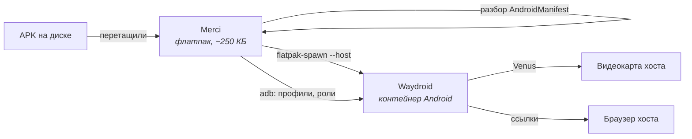

<div align="center">


# Merci

**Android-приложения в Linux — перетащил APK и запустил.**

[](https://github.com/melineceo/Merci/releases)
[](#-это-beta)
[](LICENSE)
[](#установка)

</div>

---

## ⚠️ Это beta

Merci работает и делает то, что обещает, но проверена она на одной машине и в
одной связке. Что это значит на практике:

- **Ускорение доведено пока только для NVIDIA.** Штатный Waydroid рисует через
  Mesa, а Mesa не умеет проприетарный драйвер NVIDIA — картинку считал бы
  процессор. Merci ставит и настраивает `waydroid-nvidia` (Venus поверх
  проприетарного драйвера), и это проверено на живой машине. На AMD и Intel
  приложение запускается и работает, но частоту кадров там никто не измерял и
  отдельных настроек для них нет.
- **Проверено на CachyOS (Arch) с Hyprland/Wayland.** Установка недостающего
  собирается через `pacman` и AUR, так что на не-Arch дистрибутивах мастер
  подготовки не отработает — само приложение при уже настроенном Waydroid
  будет работать.
- Ошибки и странности ожидаемы. Если что-то не так — заводите issue, в
  README ниже подробно расписано, как всё устроено внутри.

---

Альтернатива Sober: библиотека APK с графической оболочкой, куда можно
перетащить **любой** Android-APK, а не только официальный клиент Roblox.

Merci разбирает APK сам (пакет, версия, launcher-activity, ABI, иконка), ставит
его в Waydroid и запускает — от пользователя не требуется ни команд, ни
настройки контейнера.

| Что в APK | Как исполняется | Скорость |
|---|---|---|
| есть код под процессор машины (`x86_64`, `x86`) или нативного кода нет вовсе | напрямую процессором | полная |
| только `arm64-v8a` / `armeabi-v7a` | через native bridge (`libhoudini`) внутри контейнера | ниже, трансляция ARM64 → x86_64 |

Рисует в обоих случаях видеокарта хоста.



## Установка

Нужен `flatpak`. Среда выполнения GNOME приезжает с Flathub, само приложение —
из репозитория Merci:

```bash
flatpak remote-add --user --if-not-exists flathub \
  https://dl.flathub.org/repo/flathub.flatpakrepo
flatpak remote-add --user --if-not-exists merci \
  https://melineceo.github.io/Merci/merci.flatpakrepo
flatpak install --user merci xyz.hackerstone.Merci
```

Запуск: `flatpak run xyz.hackerstone.Merci` или значок «Merci» в меню приложений.

### Обновление

```bash
flatpak update --user xyz.hackerstone.Merci
```

Новые версии появляются в том же репозитории, так что `flatpak update` без
аргументов подхватит Merci вместе с остальным.

### Без репозитория

К каждому релизу приложен файл `Merci.flatpak` — на случай, когда репозиторий
недоступен. Обновляться такая установка не умеет:

```bash
flatpak install --user ./Merci.flatpak
```

Первый запуск сам предложит подготовить Waydroid: проверит модуль ядра, пакет,
образ Android, сессию и трансляцию ARM64 — и поставит недостающее, показывая
живой журнал. Понадобится пароль: контейнер и модуль ядра живут на хосте.

## Возможности

- **Перетащите APK в окно** — Merci прочитает `AndroidManifest.xml` (свой
  парсер бинарного AXML, без внешних зависимостей), вытащит иконку и определит,
  нужен ли для этого APK native bridge.
- **Автоустановка Waydroid** — мастер проверяет модуль ядра, пакет, образ
  Android, сессию и трансляцию ARM64, ставит чего нет и показывает живой лог.
- **Интерфейс не ждёт хост.** Все обращения к waydroid уходят в отдельный
  поток, состояние кешируется на несколько секунд, иконки держатся готовыми
  текстурами. Раньше каждый щелчок по приложению запускал несколько процессов
  через портал прямо в главном потоке — окно замирало.
- **Разрешение рендера** задаётся в карточке. Это свойство контейнера
  (`persist.waydroid.width/height`), поэтому Merci заодно перезапускает сессию —
  иначе значение не подхватится. Картинка при этом растягивается на монитор.
- **Отчёт о падении** читается без прав root: Android складывает его в
  `data/tombstones`, а не только в `logcat`. Merci проверяет их через 12 секунд
  после запуска и говорит, если приложение упало, — раньше это выглядело как
  «не запустилось», и хотелось нажать ещё раз.
- **Несколько сборок одного пакета** уживаются рядом в библиотеке: ключ
  записи — пакет плюс хеш файла. Установить их в контейнер одновременно
  Android не даст (см. про профили ниже), но Merci объяснит это и предложит
  заменить установку одним нажатием.
- **Профили Android (MultiUser)** — отдельные данные одного приложения:
  второй аккаунт без выхода из первого.
- **Значок в трее** с меню контейнера, и окно само уходит в трей, когда игра
  запустилась.
- **Никакого доступа к `$HOME`**: APK попадает внутрь только через портал
  выбора файлов или перетаскивание, по одному файлу за раз.

## Сборка из исходников

```bash
./scripts/build.sh
flatpak run xyz.hackerstone.Merci
```

Скрипт доставит с Flathub `org.gnome.Platform//50` и `org.gnome.Sdk//50`,
соберёт флатпак в локальный репозиторий `repo/` и установит его в
пользовательскую область. Сам флатпак крошечный — около 250 КБ: весь Android
живёт в контейнере на хосте.

**Собирайте только под x86_64.** Сборка под aarch64 существовала, чтобы гонять
ARM-код через qemu-user, и этот путь оказался тупиковым. Если она
осталась — снесите, иначе `flatpak run` без `--arch` иногда стартует именно её,
и тогда медленно работает всё, включая интерфейс:

```bash
flatpak uninstall --user --arch=aarch64 xyz.hackerstone.Merci
```

Merci сама замечает, что запущена под эмуляцией, и говорит об этом при старте.

## Подготовка Waydroid

Мастер («Подготовить» в баннере или пункт меню) собирает план из того, чего не
хватает, и выполняет шаги по очереди, показывая вывод в журнале:

| Шаг | Как выполняется |
|---|---|
| Модуль ядра `binder` | пропускается, если ядро уже умеет binder (в CachyOS — да, `CONFIG_ANDROID_BINDERFS=y`) |
| Пакет `waydroid` | `sudo pacman -S --needed waydroid` — есть в репозитории `extra` |
| Образ Android | `sudo waydroid init`, ~1 ГБ с sourceforge |
| Сессия | `waydroid session start` — фоновый шаг: команда не завершается, это и есть процесс сессии, поэтому готовность проверяется по `waydroid status` |
| Доступ в интернет | `ufw allow in on waydroid0` — по умолчанию `ufw` рубит контейнеру DHCP и форвардинг |
| Архив транслятора | качает сама Merci: с докачкой `-C -` и повторами, с проверкой md5 |
| Трансляция ARM64 → x86_64 | `waydroid_script` с GitHub, затем `install libhoudini` |

Что видно во время работы:

- крупный процент и полоса загрузки — они настоящие: `waydroid init` печатает
  `[Downloading] 519.31 MB/1235.02 MB   8.3 MB/s`, и Merci разбирает эту строку
  в проценты, скорость и остаток времени;
- название текущей фазы человеческими словами («Загружаем образ системы»,
  «Распаковываем образ», «Настраиваем контейнер»);
- номер шага, прошедшее время и кнопка отмены;
- журнал с полным выводом команд — свёрнут, пока всё идёт нормально;
- если шаг молчит дольше 20 секунд, в журнале появляется строка об этом: тишина
  обычно означает ожидание пароля, а не зависание.

Пароль root Merci не видит и не запрашивает. Шаги с правами идут через
`sudo -A`: пароль спрашивает **системный диалог** (`kdialog`, при его
отсутствии `zenity`), а отдаёт его напрямую sudo. Помощник для этого — файл
`askpass.sh` в данных Merci из трёх строк, и последняя из них `exec`, так что
после запуска диалога в цепочке передачи пароля не остаётся ни одной нашей
команды. Ввод скрыт, окно само забирает фокус.

Терминал с `sudo` остаётся запасным путём — если в системе нет ни `kdialog`,
ни `zenity`. У него два известных подвоха, и оба обойдены: окно терминала может
не получить фокус клавиатуры (и тогда пароль уходит в другое окно), а команду
нельзя оборачивать в `timeout` без `--foreground` — иначе она попадает в фоновую
группу процессов, и `sudo` на попытке прочитать пароль получает `SIGTTIN` и
останавливается, успев напечатать приглашение.

`pkexec` не используется: polkit в сеансах вроде Hyprland нередко считает, что
агент для сессии уже зарегистрирован, хотя фактически спросить пароль некому — и
тогда `pkexec` висит молча и бесконечно, без ошибки и без таймаута.

### Если сервер образов недоступен

`waydroid init` начинает с обращения к `ota.waydro.id` — это указатель на
образы, и раздаётся он через GitHub Pages. Запрос идёт через `urllib` **без
таймаута**, поэтому при блокировке команда висит бесконечно и молча: ни ошибки,
ни вывода, ни завершения. Со стороны это выглядит как зависший установщик.

Merci проверяет связь отдельным шагом «Связь с сервером образов» и упирается в
него за 15 секунд с понятным объяснением. Варианты дальше:

- включить VPN и нажать «Проверить заново»;
- прописать своё зеркало в `ota.conf` в данных Merci (первая строка — system,
  вторая — vendor). Тогда шаг проверки пропускается, а адреса уходят в
  `waydroid init -c … -v …`:

```bash
printf '%s\n%s\n' https://зеркало/system https://зеркало/vendor \
  > ~/.var/app/xyz.hackerstone.Merci/data/merci/ota.conf
```

Качать образы напрямую с SourceForge Merci не пытается: сами файлы доступны, но
скорость с зеркал там оказалась порядка 70 КБ/с — образ на гигабайт шёл бы часами.

Все шаги с правами обёрнуты в `timeout --foreground 3600`, так что бесконечно не
висит ничто. Флаг `--foreground` здесь обязателен: без него `timeout` уводит
команду в собственную группу процессов, для терминала она становится фоновой, и
на попытке прочитать пароль ядро присылает `SIGTTIN` — `sudo` останавливается,
успев напечатать приглашение, а ввод остаётся непрочитанным.

Отдельная тонкость, из-за которой прогресс раньше не появлялся вообще:
`waydroid` написан на Python, а Python при выводе в конвейер буферизует блоками
по 8 КБ. Строки прогресса оставались в буфере и не доходили ни до журнала, ни
до самого терминала. Поэтому команды запускаются с `PYTHONUNBUFFERED=1`.

## Частота кадров в Waydroid

Контейнер рисует **на процессоре**, и это видно в его свойствах:

```
ro.hardware.gralloc=default
ro.hardware.egl=swiftshader
```

Аппаратный путь Waydroid включает только при `gralloc=gbm`, а он требует, чтобы
видеокарту хоста умела Mesa. С проприетарным драйвером NVIDIA этого не
происходит: Mesa такую карту не видит (`nouveau` при этом не загружен), поэтому
Waydroid сам выбирает программный рендер. Настройкой это не лечится — либо
переход на `nouveau`/NVK, либо смириться.

Отсюда единственный рабочий рычаг — **число пикселей**, и Merci настраивает это
сама. Мастер подготовки добавляет два шага, если они нужны:

| Шаг | Что делает |
|---|---|
| Установить gamescope | `pacman -S --needed gamescope`, если его нет; шаг сам ждёт чужой pacman и снимает осиротевший `db.lck` |
| Подгонка под экран | ставит контейнеру 1280×720 и поднимает сессию внутри gamescope с выводом на весь монитор |

Так контейнер рисует вдвое меньше пикселей, а изображение занимает экран целиком.
Слегка мылит — это цена масштабирования.

Перед этим Merci проверяет, что gamescope на этой машине **действительно
работает**: запускает его вхолостую и смотрит, жив ли он через пять секунд.
С проприетарным драйвером NVIDIA он падает ещё до окна
(`vkGetPhysicalDeviceFormatProperties2 returned zero modifiers`,
`NVVM compilation failed`), и кода возврата тут мало — он успевает выйти нулём.
Если проба не прошла, растягивания не будет, а окно контейнера получит размер
монитора: пикселей больше, зато без чёрных полей.

Почему именно так: **Waydroid своё окно не масштабирует**. Его поверхность
всегда равна разрешению контейнера, а `wm size` не растягивает картинку, а рисует
экран поменьше в углу большой поверхности — отсюда серые поля по краям. Растянуть
может только внешний компоновщик, поэтому сессия и запускается внутри gamescope:

```sh
gamescope -W 1920 -H 1080 -w 1280 -h 720 -f -- waydroid session start
```

В карточке приложения то же самое можно задать вручную: поле разрешения, кнопка
рядом подставляет размер монитора, пустое поле возвращает всё как было. Если
gamescope не установлен, Merci предложит его поставить. При аппаратном рендере
ужимать нечего, и шаг подгонки в план не попадает.

## Значок в трее и сворачивание

Merci живёт в системном трее: левое нажатие открывает окно, правое — меню с
тем, что нужно чаще всего.

```
Открыть Merci
Открыть окно Android          полный рабочий стол контейнера
Открыть запущенную игру       поднимает последнее, что запускали
Включить Waydroid
Выключить Waydroid
Выйти из Merci
```

Крестик прячет окно в трей, а не закрывает программу — выйти можно из того же
меню. Если трея в системе нет, крестик работает как обычно.

**«Сворачивать Merci при запуске приложения»** («Настройки → Окно», включено по
умолчанию): через пару секунд после запуска игры окно Merci убирается в трей —
библиотека нужна была ровно до нажатия, а поверх игры она лишняя.

Трея на Wayland как такового нет: панель держит на шине службу
`org.kde.StatusNotifierWatcher`, а приложение регистрирует в ней свой объект и
дальше само отвечает на вопросы о значке и меню. У GTK4 своего API для этого не
осталось (GtkStatusIcon убран, libappindicator живёт в GTK3), поэтому обе
стороны разговора — `StatusNotifierItem` и `com.canonical.dbusmenu` — написаны
в [src/merci/tray.py](src/merci/tray.py) напрямую через Gio. Регистрируемся по
уникальному имени соединения, так что из песочницы хватает одного права —
`--talk-name=org.kde.StatusNotifierWatcher`, без владения чужими именами.

## Профили Android (MultiUser)

Профиль Android даёт одному приложению **отдельные данные**: свой вход, свой
кеш, свои настройки. Так запускают второй аккаунт, не выходя из первого.
Включается в «Настройки → Использовать MultiUser», после чего в карточке
появляется выбор профиля: «основной», уже заведённые и «Новый профиль…».
Merci сама ставит приложение в выбранный профиль и переключает на него
контейнер перед запуском.

Android показывает на экране одного пользователя за раз, поэтому профили
работают по очереди, а не одновременно; переключение занимает несколько
секунд.

Разовая подготовка (Merci предложит её сама, нужен пароль):

- ставит `android-tools` — сам `adb`;
- пишет в `waydroid_base.prop` строку `fw.max_users=4`: без неё Android в
  этом образе держит одного пользователя и отвечает отказом на попытку
  завести второго;
- пишет туда же `ro.adb.secure=0`. Merci ходит к `pm` и `am` через `adbd`
  контейнера, а с проверкой ключа первое подключение упирается в окно
  подтверждения внутри Android. Порт слушает только мост контейнера
  (`192.168.240.1/24`), и на машине он был открыт и раньше.

Через `adb`, а не как обычно, потому что служба Waydroid — та, через которую
идут `waydroid app install` и `launch`, — знает только нулевого пользователя:
ни поставить в профиль, ни запустить в нём она не умеет.

Две тонкости, без которых профили выглядели сломанными:

- **Окно.** Waydroid по умолчанию однооконный и показывает то приложение,
  которое названо в свойстве `waydroid.active_apps`. Его выставляет
  `waydroid app launch`, а `am start` — нет, поэтому приложение в профиле
  честно работало (`ps` показывал процесс `u10_…`), но окна не было вовсе.
  Merci теперь ставит это свойство сама, как делает waydroid, и заодно
  режим отображения `policy_control`.
- **Возврат в основной профиль.** Профиль контейнера — состояние общее.
  Запуск приложения из основного профиля возвращает контейнер на нулевого
  пользователя, даже если MultiUser потом выключили: иначе приложение
  стартует в нулевом профиле, а на экране остаётся чужой — и снова нет окна.

### Чего профили не дают

**Двух разных сборок одного пакета.** Для Android имя пакета — это одна
установка на всё устройство: профили делят между собой код приложения и
различаются только данными. Обычный клиент Roblox и модифицированный носят
одно имя `com.roblox.client`, но подписаны разными ключами, и контейнер
отвечает прямо:

```
INSTALL_FAILED_UPDATE_INCOMPATIBLE: Existing package com.roblox.client
signatures do not match newer version; ignoring!
```

Ни `--user`, ни разрешение понижения версии тут не помогают — проверено на
живом контейнере. Поэтому Merci не делает вид, что умеет обходить это
правило: при запуске второй сборки она объясняет, что происходит, и
предлагает **заменить установку** — снять прежнюю и поставить эту. Данные
прежней сборки внутри Android при этом стираются: так требует Android при
смене подписи.

Сборку Merci сверяет по самому файлу, а не по имени пакета. Имени мало:
у обычного и модифицированного клиента оно одно, и на проверке «пакет уже
установлен» Merci однажды молча открыла чужую сборку, отрапортовав об
успехе. Теперь сравнивается начало sha256 — у нас оно в ключе записи, а от
контейнера берётся `sha256sum` над установленным `base.apk`. В карточке это
видно строкой «Сборка в контейнере»: «эта — можно запускать» или «другая
(версия …) — при запуске Merci предложит заменить».

Если хочется именно две сборки одновременно, единственный честный путь —
чтобы у них были **разные имена пакетов**. Это решает не Merci, а тот, кто
собирал APK: некоторые модифицированные клиенты специально выходят под своим
именем пакета и тогда прекрасно живут рядом с обычным.

## Удаление приложений из контейнера

В карточке две разные кнопки:

- **«Удалить из контейнера»** — снимает установку в Waydroid вместе с данными
  внутри Android, APK остаётся в библиотеке;
- **«Удалить из библиотеки»** — стирает APK и данные здесь, а следом убирает
  установку и из контейнера. Если тем же пакетом пользуется другая запись
  библиотеки, установка не трогается: иначе удаление одной сборки уносило бы
  соседнюю.

Удаление идёт тремя путями, от тихого к заметному. Через `adb`, если он есть
(появляется вместе с MultiUser) — самый надёжный. Иначе штатной службой
Waydroid — но она умеет отказывать молча: пишет `Failed with code: -3` и
выходит с нулевым кодом, поэтому Merci проверяет не код возврата, а вывод.
Если служба отказала, в ход идёт намерение `ACTION_DELETE`: Android
показывает свой обычный вопрос «удалить приложение?» в окне контейнера, и
Merci предлагает это окно открыть.

## Root в контейнере

Меню → «Установить root (Magisk)». Ставится Magisk Delta через тот же
`waydroid_script`: это ваш собственный Android, поэтому доступ к системным
разделам, отладка и модули — нормальная его возможность.

Одна тонкость чужого кода: для Magisk `waydroid_script` **удаляет уже скачанный
файл и качает заново**, без проверки суммы. На нестабильном канале это верный
провал, поэтому Merci качает APK сама (с докачкой и повторами), а в своей копии
скрипта делает загрузку условной — двумя `sed` по `stuff/magisk.py`, с
комментарием прямо в шаге.

Проверку устройства играми root не проходит и пройти не может — наоборот, для
таких проверок контейнер с Magisk выглядит подозрительнее. Модули подмены
аттестации Merci не ставит.

Убирается тем же путём: «Убрать root (Magisk)» в меню — `waydroid_script
remove magisk` и перезапуск контейнера. Ставить root и не иметь способа его
снять — плохая сделка.

## Аппаратное ускорение на NVIDIA

Штатный Waydroid рисует через Mesa, а Mesa не умеет проприетарный драйвер
NVIDIA — отсюда `ro.hardware.egl=swiftshader` и рендер процессором. Обходится
это проектом [waydroid-nvidia](https://github.com/Shiro836/waydroid-nvidia):
гостю подставляется Mesa Venus, а вызовы Vulkan проксируются через unix-сокет
в настоящий драйвер хоста.

Меню → «Аппаратное ускорение NVIDIA». Merci сначала проверяет пригодность
машины и отказывается, если она не подходит:

| Требование | Почему |
|---|---|
| открытые модули ядра (`nvidia-open`) | у закрытых нет DMA-BUF, а здесь каждый выводимый буфер — именно он |
| драйвер 595.71+ | раньше нужные интерфейсы отсутствуют |
| Turing или новее | следствие открытых модулей |

Шаг ставит `waydroid-nvidia-bin` из AUR (пакет **заменяет** `waydroid` — это тот
же Waydroid с патчами, образ и данные остаются), запускает
`waydroid-nvidia-setup` с частотой вашего монитора, включает службы
`waydroid-container` и `wd-venus` и перезапускает сессию. `yay` работает от
пользователя, а его внутренний `sudo` получает `-A`, чтобы пароль спрашивал тот
же системный диалог.

Проверить результат:

```bash
sudo waydroid shell dumpsys SurfaceFlinger | grep GLES
# должно появиться ANGLE (NVIDIA, Vulkan ... Venus (NVIDIA GeForce ...))
```

Если строка такая — рисует видеокарта, и подгонка разрешения из соображений
скорости больше не нужна.

## Мерцание картинки

Симптом характерный: кадр замирает, а картинка обновляется **только на события** —
нажатие любой клавиши (годится даже Alt, который ничего не открывает), вход
курсора в окно, появление экранной клавиатуры.

Причина — режим `persist.waydroid.use_subsurface`, который waydroid-nvidia
включает по умолчанию. Android-слои рисуются в `wl_subsurface`, а синхронная
подповерхность показывается только тогда, когда коммитит **родительская**
поверхность. Родитель молчит — кадр висит; любое событие заставляет его
коммитнуть, и картинка «чинится».

Merci видит это состояние и добавляет в план шаг «Исправить мерцание картинки»
(он же есть отдельным пунктом меню). Шаг выключает режим **в обоих файлах** и
перезапускает контейнер:

| Файл | Зачем править |
|---|---|
| `waydroid.cfg` | применяется при старте сессии |
| `waydroid_base.prop` | читает `init` при загрузке контейнера — иначе перезапуск вернёт прежнее значение |

Кстати, о разнице этих двух файлов стоит помнить и вообще: свойства `ro.*`
Android разрешает задать только до старта `init`, поэтому из `waydroid.cfg` они
молча игнорируются и работают лишь из `waydroid_base.prop`. На этом легко
потерять час, проверяя настройку, которая не применилась.

## Ссылки в браузере хоста

Передачи ссылок из контейнера на хост в Waydroid нет — работает только
обратное направление (`waydroid app intent`), это открытая заявка
[waydroid#210](https://github.com/waydroid/waydroid/issues/210). Поэтому
ссылка из приложения открывается браузером самой Android.

Merci закрывает пробел собственным перехватчиком. Пункт меню «Ссылки в
браузере хоста» собирает и ставит его:

- **Android-приложение** ([data/urlforward](data/urlforward)) — activity без
  интерфейса с `intent-filter` на `VIEW` для `http`/`https`. Получив ссылку,
  отправляет её на шлюз контейнера и сразу закрывается.
- **Служба на хосте** — `merci-url-listener.py` под systemd пользователя.
  Слушает **только** адрес моста `192.168.240.1:7749`: из контейнера доступно,
  снаружи машины нет. Пропускает исключительно `http`/`https` и передаёт адрес
  `xdg-open` списком аргументов, без оболочки.

Сборка идёт без Gradle, четырьмя вызовами: `javac` → `d8` → `aapt2 link` →
`apksigner` с одноразовым ключом. Из инструментов нужны JDK (репозиторий) и
`android-sdk-build-tools` (AUR, зависимости только из репозиториев).
`android.jar` качается **отдельным файлом** с `dl.google.com`: пакет
`android-platform` потянул бы за собой `android-sdk` и
`android-sdk-platform-tools` — половину SDK ради одной библиотеки, нужной
только на время компиляции.

Проверять установку по `waydroid app list` бесполезно: там только приложения с
иконкой в меню, а у перехватчика её нет. Merci смотрит на каталог данных,
который Android создаёт при установке пакета.


### Браузер по умолчанию внутри Android

Мало поставить перехватчик — Android будет спрашивать при каждой ссылке, чем
её открыть. Поэтому шаг заодно назначает его **браузером по умолчанию**
штатным способом Android — ролью:

```
cmd role add-role-holder --user 0 android.app.role.BROWSER xyz.hackerstone.merci.urlopen
```

Перехватчик этой роли подходит: он ловит `http` и `https` без указания хоста,
то есть с точки зрения Android ведёт себя как браузер. Нужен `adb` — он
приходит вместе с MultiUser; без него шаг честно скажет, что назначить нечем.

**Роль своя у каждого профиля.** Игра, запущенная в профиле №10, открывала
ссылки внутренним браузером Android, потому что роль там принадлежала ему, а
перехватчик в профиль включён не был. Поэтому Merci перед запуском в профиле
включает в нём перехватчик и выдаёт роль:

```
cmd package install-existing --user 10 xyz.hackerstone.merci.urlopen
cmd role add-role-holder --user 10 android.app.role.BROWSER xyz.hackerstone.merci.urlopen
```

`install-existing` именно включает уже лежащий в контейнере пакет в профиле —
качать и ставить заново нечего. Новый профиль получает то же самое при
создании.

Ещё две правки по ходу дела: ключ подписи APK теперь лежит рядом с
исходниками, а не создаётся заново на каждую сборку — иначе Android отказывался
обновлять уже установленный перехватчик («signatures do not match»). И неудача
отправки больше не проглатывается молча, а пишется в журнал Android: без этого
«ссылка не открылась» выглядело как пустота, в которой нечего искать.

## Перезапуск контейнера

Кнопка со стрелкой рядом с «Запустить» (и такая же строка в карточке, и пункт
в меню трея). Нужна чаще, чем кажется.

**Сразу после включения машины** контейнер поднимается «наполовину»: сессия
запущена, а сети внутри нет, и `waydroid status` вместо адреса пишет:

```
Session:    RUNNING
Container:  RUNNING
IP address: UNKNOWN
```

Merci ходит к контейнеру через adb, и раньше это слово уезжало в команду
целиком — отсюда ошибка `error: device 'UNKNOWN:5555' not found`. Теперь за
адрес принимается только то, что им выглядит, а если адреса нет — Merci ждёт
его и, не дождавшись, перезапускает сессию сама. Обычно этого хватает: адрес
появляется секунд за двадцать.

**Когда не хватает.** Android внутри переживает перезапуск сессии — контейнер
продолжает работать, и время его работы не сбрасывается. Если завис именно он
(ARP до контейнера не проходит, `waydroid prop` отвечает «Failed to get service
waydroidplatform»), сессию можно перезапускать сколько угодно без толку.
Поэтому Merci проверяет не только адрес, но и то, что контейнер отвечает, и в
таком случае предлагает перезапустить его целиком — это уже
`systemctl restart waydroid-container` и пароль.

## Выключение контейнера

Пункт меню «Выключить Waydroid» останавливает контейнер целиком. Одной
команды для этого мало: `waydroid session stop` регулярно упирается в таймаут
D-Bus и оставляет процесс менеджера сессии живым — после чего состояние
расходится, `waydroid status` показывает RUNNING, а `waydroid prop` отвечает,
что сессия остановлена. Поэтому Merci после команды добивает остатки и
проверяет результат по `waydroid status`, а не по коду возврата.

## Ошибка Roblox 317

`This game has enabled additional hardware security requirements` — это
серверная проверка, которую включает **автор конкретной игры**. Она требует
аппаратной аттестации устройства (Play Integrity), а Waydroid — это LineageOS с
тестовыми ключами и без сервисов Google, поэтому проверку он не пройдёт никогда.
Обойти её нельзя и не нужно: это защита игры, а не поломка. Игры без такой
настройки работают.

## Права флатпака

| Право | Зачем |
|---|---|
| `--socket=wayland`, `--socket=fallback-x11`, `--share=ipc` | окно |
| `--device=dri` | GPU для интерфейса |
| `--socket=pulseaudio`, `--share=network` | звук и сеть |
| `--talk-name=org.freedesktop.Flatpak` | `flatpak-spawn --host` для разговора с Waydroid |

Последнее право — осознанная уступка и стоит того, чтобы её понимать: это
исполнение команд на хосте, то есть выход из песочницы. Waydroid иначе
недостижим — он служба хоста с модулем ядра и systemd-юнитом. Отсюда
вызываются только `waydroid`, `pacman` и `pkexec` для шагов установки.

## Почему запуск только один

Раньше Merci умела запускать APK и внутри себя, через
[ATL](https://gitlab.com/android_translation_layer/android_translation_layer):
ART исполняет dex, Android-API подменён поверх хостового glibc, окно нативное —
тот же принцип, что у Sober. Путь был быстрым на старте и не требовал
контейнера. Его убрали, и вот почему.

**ATL — не полный Android.** Универсальная сборка Roblox гибла на третьей
секунде, ещё до своего кода. Разбор занял долгую сессию и дал четыре настоящие
находки, каждая подтверждена журналом и стеком:

1. В `android.os.Build` нет полей `SUPPORTED_64_BIT_ABIS` и
   `SUPPORTED_32_BIT_ABIS` — приложение, которое само решает, какие библиотеки
   распаковывать, получает `NoSuchFieldError`, и ART гасит процесс.
2. `libroblox.so` объявляет в DT_NEEDED `libmediandk.so` и `libOpenMAXAL.so`,
   которых в ATL нет вовсе, — нативный код не линковался целиком.
3. `ActivityManager.getMyMemoryState()` не делал ничего, и поле `importance`
   оставалось нулём — значения, которого в Android не существует. Roblox
   спрашивал «я на переднем плане?», получал «нет» и сворачивал запуск:
   `Background process detected`. Следом выяснилось, что нет и поля `pkgList`.
4. Линковщик из `bionic_translation` держит **нерекурсивный** мьютекс на
   `dlopen`/`dlsym`, а конструкторы библиотеки вызываются, пока замок ещё
   удерживается. `libroblox.so` зовёт оттуда `dlopen` — и процесс встаёт
   намертво: главный поток ждёт замок, который держит сам. В настоящем Android
   этот замок рекурсивный именно поэтому.

Все четыре были закрыты, и Roblox стал доходить сильно дальше: ART поднимался,
117-мегабайтная `libroblox.so` грузилась, приложение ходило в сеть за флагами и
добиралось до `AppManager.initialize`. Но там упиралось окончательно — рабочий
поток самой игры крутился вхолостую внутри закрытого кода, `onCreate` не
возвращал управление, окна не было. Дальше пришлось бы чинить не ATL, а чужую
игру.

**И главное: выигрыш исчез.** В Waydroid код под процессор машины исполняется
**нативно**, без всякой трансляции, а рисует видеокарта хоста через Venus. То
есть ради того же самого больше не нужен второй способ запуска со своим набором
заплаток — Waydroid делает это настоящим Android и без сюрпризов.

Правка линковщика сохранена отдельно: она чинит настоящую ошибку в чужом
проекте, и её стоит отправить авторам —
[upstream-patches/](upstream-patches/).

## Почему транслятор по умолчанию — libhoudini

Оба транслятора умеют ARM64 → x86_64, но по-разному переживают код, который
приложение генерирует на лету. У Roblox так работает JIT виртуальной машины
Luau, и `libndk_translation` на нём стабильно падает:

```
Cmdline: com.roblox.client
signal 11 (SIGSEGV), code 2 (SEGV_ACCERR)
#01 libndk_translation.so (ndk_translation_HandleNoExec+208)
#02 libndk_translation.so (ndk_translation::ExecuteGuest+228)
```

`HandleNoExec` — это его обработчик неисполняемой памяти, то есть ровно то
место, где транслятор должен подхватить сгенерированный код. С `libhoudini` то
же приложение работает. Поэтому мастер ставит `libhoudini`, а сменить его на
`libndk` можно в меню — некоторым приложениям больше подходит он.

Отчёт о падении Merci показывает сама: меню → «Журнал сбоев Android». Он берёт
свежий `tombstone` из `~/.local/share/waydroid/data/tombstones`, и прав root
для этого не нужно, в отличие от `waydroid logcat`.

## Что стоит понимать

- Waydroid — контейнер Android, а не изолированная песочница флатпака.
  Приложение внутри живёт по правилам Android и остаётся установленным в
  контейнере даже после удаления записи из библиотеки Merci.
- Оба транслятора — проприетарные сборки из образов Android x86_64, их тянет
  `waydroid_script` с GitHub. Merci качает архивы сама (с докачкой и проверкой
  md5), потому что сам скрипт делает это одним запросом и умирает на первом
  обрыве связи.
- Модифицированные клиенты игр нарушают их правила пользования, а такие
  правила обычно оканчиваются блокировкой аккаунта. Merci запускает APK-файл и
  ничего о его содержимом не знает.

## Версии и выпуск

Версия живёт в одном месте — `VERSION` в
[src/merci/main.py](src/merci/main.py), — и оттуда её берут и окно «О
программе», и скрипт публикации. Список изменений ведётся в
[data/xyz.hackerstone.Merci.metainfo.xml](data/xyz.hackerstone.Merci.metainfo.xml):
его читают магазины приложений.

Чтобы выпустить новую версию:

```bash
# 1. поднять номер в src/merci/main.py и добавить <release> в metainfo
# 2. собрать репозиторий и одиночный файл
bash scripts/publish.sh
# 3. выложить репозиторий на GitHub Pages
bash scripts/publish-pages.sh
# 4. пометить выпуск
git tag v0.1.0 && git push origin v0.1.0
```

Шаг с тегом запускает [рабочий процесс](.github/workflows/publish.yml): он
собирает флатпак на стороне GitHub, кладёт репозиторий на Pages и прикладывает
`Merci.flatpak` к релизу. Локальные скрипты нужны, когда хочется выложить
вручную или проверить сборку до тега.

У пользователей обновление выглядит как `flatpak update` — ничего скачивать и
переустанавливать не нужно.

### Подпись репозитория

По умолчанию репозиторий раздаётся без подписи GPG: канал защищён HTTPS
GitHub Pages. Если хочется подписи — задайте ключ, и `publish.sh` подпишет
репозиторий и вложит открытый ключ в `.flatpakrepo`, а клиенты начнут
проверять образы:

```bash
MERCI_GPG_KEY=ВАШ_КЛЮЧ bash scripts/publish.sh
```

## Структура

```
xyz.hackerstone.Merci.yaml   манифест флатпака
scripts/build.sh             сборка и установка
scripts/merci-launcher       точка входа внутри флатпака
src/merci/apk.py             разбор APK и бинарного AXML
src/merci/library.py         библиотека и метаданные
src/merci/settings.py        настройки (файл settings.json)
src/merci/tray.py            значок в трее: StatusNotifierItem и меню
src/merci/hostexec.py        вызовы хоста в потоке и кеш состояния
src/merci/waydroid.py        состояние Waydroid, план установки, трансляторы,
                             разрешение контейнера, запуск APK
src/merci/installer.py       мастер подготовки с прогрессом и логом
src/merci/window.py          интерфейс GTK4/libadwaita
src/merci/main.py            приложение, действия, «О программе»
data/icons/                  значок приложения (готовые размеры png)
data/urlforward/             перехватчик ссылок для Waydroid
upstream-patches/            правка к чужому проекту, в сборке не участвует
```

Лицензия: MIT.
